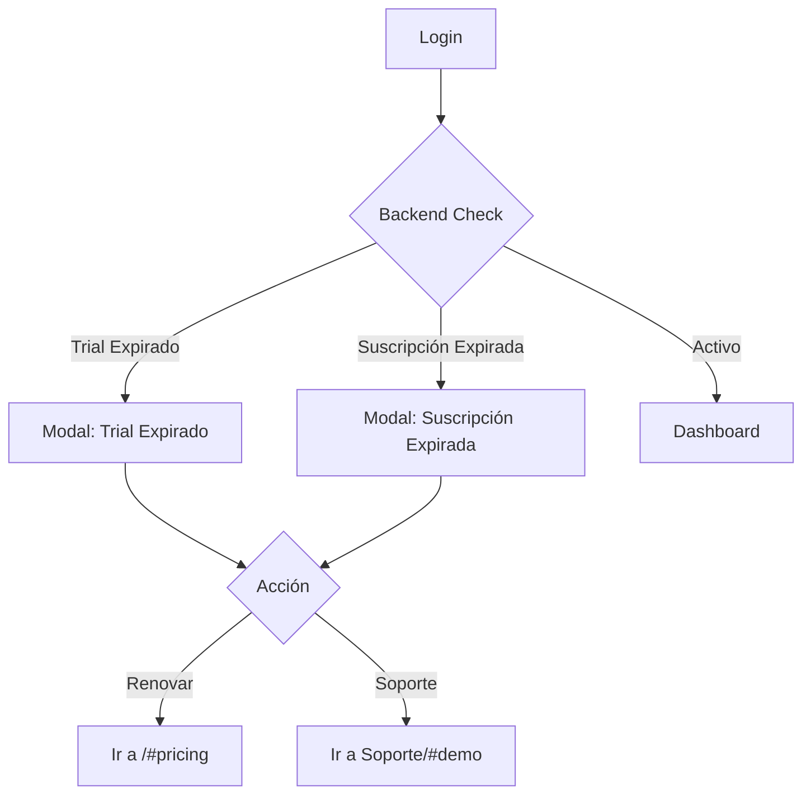

# 🎨 Modal de Expiración - Suscripción y Trial

## ✅ Funcionalidad Completa

El sistema ahora maneja elegantemente dos escenarios críticos de expiración:
1. **Trial Expirado**: Cuando terminan los 14 días de prueba gratuita.
2. **Suscripción Expirada**: Cuando un pago falla o la suscripción se cancela y expira.

El usuario ve un **modal claro y bonito** que le explica la situación y le da opciones para resolverlo sin poder acceder al dashboard hasta entonces.

---

## 🚀 Flujo de Usuario



---

## 🛠 Cambios Técnicos

### **Backend (`AuthService`)**
- Verifica `trialEndsAt` y `subscriptionStatus === 'trial'`
- Verifica `currentPeriodEnd` si la suscripción está `active`, `past_due` o `canceled`
- Devuelve flags:
  - `trialExpired`
  - `subscriptionExpired`
  - Fechas correspondientes

### **Frontend (`Login.tsx`)**
- Maneja ambos flags de expiración.
- Usa el `TrialExpiredModal` (ahora genérico) pasando:
  - `endsAt`: Fecha de expiración (cualquiera de las dos)
  - `isTrial`: Boolean para cambiar textos

### **Componente Modal (`TrialExpiredModal.tsx`)**
- Ahora es polimórfico.
- Si `isTrial=true`: Muestra mensaje de "Tu prueba ha finalizado"
- Si `isTrial=false`: Muestra mensaje de "Tu suscripción ha expirado"
- Adaptado para mostrar beneficios diferentes según el contexto

---

## 🌍 Traducciones (Ejemplo ES)

### **Trial Expirado**
> "Tu Período de Prueba ha Finalizado"
> "Continúa disfrutando de todas las funciones..."

### **Suscripción Expirada**
> "Tu Suscripción ha Expirado"
> "No pierdas acceso a tus datos y clientes..."

---

## 🧪 Cómo Probar

### **Probar Trial Expirado**
```bash
db.businesses.updateOne(
  { email: "tu@email.com" },
  { $set: { 
    trialEndsAt: new Date("2024-01-01"), 
    subscriptionStatus: "trial" 
  }}
)
```

### **Probar Suscripción Expirada**
Necesitas tener una suscripción en la BD (o simularla):
```bash
db.businesses.updateOne(
  { email: "tu@email.com" },
  { $set: { 
    subscriptionStatus: "active",
    trialEndsAt: null
  }}
)

// Y crear/actualizar registro de subscription
db.subscriptions.insertOne({
  businessId: "ID_DEL_NEGOCIO",
  status: "canceled",
  currentPeriodEnd: new Date("2024-01-01")
})
```

---

## 📝 Archivos Clave
- `frontend/src/components/TrialExpiredModal.tsx` (Componente visual)
- `backend/src/auth/auth.service.ts` (Lógica de negocio)
- `frontend/src/pages/Login.tsx` (Controlador de flujo)
